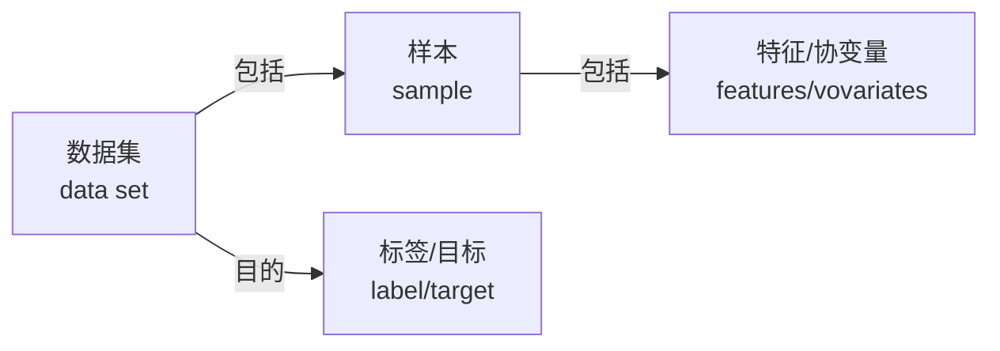

## 1.1-1.2 日常生活的机器学习和机器学习关键组件

机器学习的训练过程：

机器学习的关键组件包括：
1. 可用于学习的**数据(data)**
2. 转换数据的**模型(model)**
3. **目标函数(objective funciton)**，量化模型有效性
4. 调整参数以优化目标函数的**算法(algorithm)**

### 1.2.1 数据
数据集组成：

样本的特征有：
1. 固定长度的特征数量，特征向量定长，长度是数据的**维数(dimensionality)**，例如医疗数据
2. 不定长度的特征数量，例如文本评论

### 1.2.3-1.2.4 目标函数与优化算法
* 模型优劣程度度量是**目标函数(objective function)** 或者 **损失函数(cost function)**
* 常用的优化算法是**梯度下降(gradient descent)**，即检查每个参数，对参数进行少量变动，观察损失移动方向，在减少方向上优化参数

## 1.3 机器学习问题

* 回归问题的损失函数常用**均方误差(squared error)**，分类问题的损失函数常用**交叉熵*(cross-entropy)**
* **层次分类(hierarchical classification)** 将类别划分层级；我们有时候倾向于误分类到一个相近的类而不是遥远的类，这与风险/收益有关
* 学习预测不相互排斥的类别的问题称为**多标签分类(multi‐label classification)**，例如划分博客的多个相关标签
* 搜索问题输出的集合顺序也很重要；**推荐系统(recommender system)** 综合了搜索和排名
* 对于连续观测量的处理是序列问题
* **强化学习(reinforcement learning)** 处理机器学习与环境交互的问题
	* 当环境可被完全观察到时,强化学习问题被称为**马尔可夫决策过程(markov decision process)**
	* 当状态不依赖于之前的操作时,我们称该问题为**上下文赌博机(contextual bandit problem)**
	* 当没有状态,只有一组  最初未知回报的可用动作时,这个问题就是经典的**多臂赌博机(multi‐armed bandit problem)**

## 1.4-1.6 起源发展和运用
神经网络的核心是当今大多数网络中都可以找到的几个关键原则：
* 线性和非线性处理单元的交替,通常称为**层(layers)** 
* 使用链式规则(也称为**反向传播(backpropagation)**)一次性调整网络中的全部参数

关于神经网络的巨大进步 ([pdf](zotero://open-pdf/library/items/USPEKL7D?page=52))